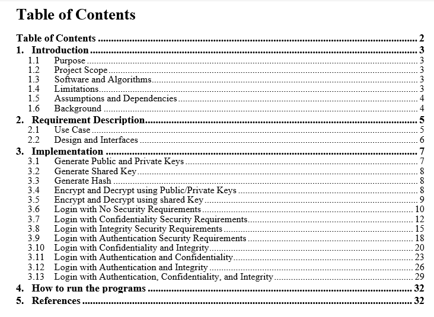

# Instant-Messaging-Program
In this homework, we need to implement a secure Instant Messaging program. This program should transmit short messages between a client and a server. The server process is instantiated first. At any time later, the client can initiate a session with the server. After establishing a session, the client and server can exchange messages
# Purpose 
The purpose is to understand the security requirements and to be familiar with the core security concepts which are confidentiality, integrity and authentication. In addition, the aim of this project is to apply different security techniques such as encryption using symmetric and asymmetric mechanisms for encryption, applying hashing, etc. 
# Project Scope
The scope of the project is to implement simple secure instant messaging where the server receives a message and send it as echo server. The proposed implementation should allow the client to communicate with server using the following options: No security, Confidentiality, Integrity, Authentication, or combinations. No security option means that the exchanged messages are transmitted in plain text. All cryptographic operations such as key exchange, public/private key generations, encryption, decryption, hashing, etc.) should be transparent to the client.
# Software and Algorithms
In this project, java programming language, NetBeans, and Wireshark are used. NetBeans is IDE that helps to write java program. Wireshark is a software that helps to monitor and validate the communication between client and the server. We use RSA, AES and MD5 algorithms. 
RSA stands for Rivest-Shamir-Adleman which used for encrypting and decrypting data using asymmetric keys. AES stands for Advanced Encryption Standard which used for encrypting and decrypting data using symmetric keys. MD5 stands for Message Digest Algorithm which used to create a hash. Hashing is one-way encryption. [2]

# Full Documentation 
The pdf file has the full documentation about the project

# Tabel of Contents

